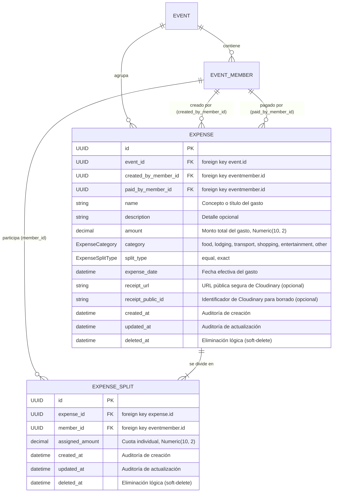

# Data Model: Gestión de Gastos y Comprobantes

**Feature**: `specs/015-expenses-management/spec.md` | **Date**: 2026-08-31

## Diagrama Entidad-Relación

---

## Enumeraciones de Dominio

### `ExpenseCategory` (StrEnum)
- `food` ("Comida", 🍴)
- `lodging` ("Hospedaje", 🏨)
- `transport` ("Transporte", 🚗)
- `shopping` ("Compras", 🛒)
- `entertainment` ("Entretenimiento", 🎟️)
- `other` ("Otra", 📦)

### `ExpenseSplitType` (StrEnum)
- `equal` (División equitativa con redondeo determinista de centavos)
- `exact` (División por montos directos especificados)

---

## Especificación Detallada de Tablas

### Tabla `expense`

| Columna | Tipo | Nulo | Restricciones / Descripción |
|---|---|---|---|
| `id` | `UUID` | No | Primary Key, `default_factory=uuid4` |
| `event_id` | `UUID` | No | Foreign Key `event.id`, Index |
| `created_by_member_id` | `UUID` | No | Foreign Key `eventmember.id`, Index |
| `paid_by_member_id` | `UUID` | No | Foreign Key `eventmember.id`, Index |
| `name` | `VARCHAR(100)` | No | Nombre o concepto del gasto |
| `description` | `VARCHAR(500)` | Sí | Descripción o notas adicionales |
| `amount` | `NUMERIC(10, 2)` | No | Monto total, Check: `amount > 0` |
| `category` | `VARCHAR(30)` | No | Valor de `ExpenseCategory` |
| `split_type` | `VARCHAR(20)` | No | Valor de `ExpenseSplitType` |
| `expense_date` | `TIMESTAMPTZ` | No | Fecha/hora en que se realizó el gasto |
| `receipt_url` | `VARCHAR(500)` | Sí | URL del comprobante en Cloudinary |
| `receipt_public_id` | `VARCHAR(200)` | Sí | Public ID en Cloudinary para eliminación |
| `created_at` | `TIMESTAMPTZ` | No | `datetime.now(UTC)` |
| `updated_at` | `TIMESTAMPTZ` | No | `datetime.now(UTC)`, actualizado en mutación |
| `deleted_at` | `TIMESTAMPTZ` | Sí | `None` por defecto. Fecha de anulación lógica |

**Índices**:
- `ix_expense_event_id_deleted_at_date`: `("event_id", "deleted_at", "expense_date")`
- `ix_expense_paid_by_member_id`: `("paid_by_member_id")`

---

### Tabla `expensesplit`

| Columna | Tipo | Nulo | Restricciones / Descripción |
|---|---|---|---|
| `id` | `UUID` | No | Primary Key, `default_factory=uuid4` |
| `expense_id` | `UUID` | No | Foreign Key `expense.id`, Index |
| `member_id` | `UUID` | No | Foreign Key `eventmember.id`, Index |
| `assigned_amount` | `NUMERIC(10, 2)` | No | Cuota individual, Check: `assigned_amount >= 0` |
| `created_at` | `TIMESTAMPTZ` | No | `datetime.now(UTC)` |
| `updated_at` | `TIMESTAMPTZ` | No | `datetime.now(UTC)` |
| `deleted_at` | `TIMESTAMPTZ` | Sí | `None` por defecto (soft-delete heredado de `BaseModel`) |

**Restricciones de Unicidad e Índices**:
- `uq_expense_split_member`: `UniqueConstraint("expense_id", "member_id", name="uq_expense_split_member")`
- `ix_expensesplit_expense_id`: `("expense_id")`
- `ix_expensesplit_member_id`: `("member_id")`

---

## Reglas de Integridad y Ciclo de Vida de Participaciones

1. **Invariante Financiera de Splits Activos**:
   $$\sum_{s \in \text{splits}, s.\text{deleted\_at IS NULL}} s.\text{assigned\_amount} == \text{expense}.\text{amount}$$
   Solo los splits con `deleted_at IS NULL` participan en la validación y cálculo de balances.
2. **Ciclo de Vida y Sincronización de Splits en Edición**:
   - Para respetar la restricción `UniqueConstraint("expense_id", "member_id")`:
     - **Permanencia**: Si un participante ya tiene un split activo, se actualiza su `assigned_amount` y `updated_at`.
     - **Reincorporación**: Si un participante fue removido en una edición previa (`deleted_at IS NOT NULL`) y se vuelve a agregar, se **reutiliza** la fila existente restaurando `deleted_at = None` y actualizando el monto.
     - **Nuevo participante**: Si nunca ha tenido un split en este gasto, se inserta una nueva fila.
     - **Remoción**: Si un participante existente ya no está en la nueva lista, se marca con soft-delete (`deleted_at = datetime.now(UTC)`).
   - Ninguna operación realiza hard-delete de participaciones.
3. **Integridad de Membresías del Evento**:
   - `created_by_member.event_id == expense.event_id`
   - `paid_by_member.event_id == expense.event_id` y `paid_by_member.status == 'active'`
   - Para todo split activo: `split.member.event_id == expense.event_id` y `split.member.status == 'active'`
4. **No Duplicados de Participantes**:
   - En una solicitud de creación o edición, cada `member_id` debe ser único en la lista de entrada.
