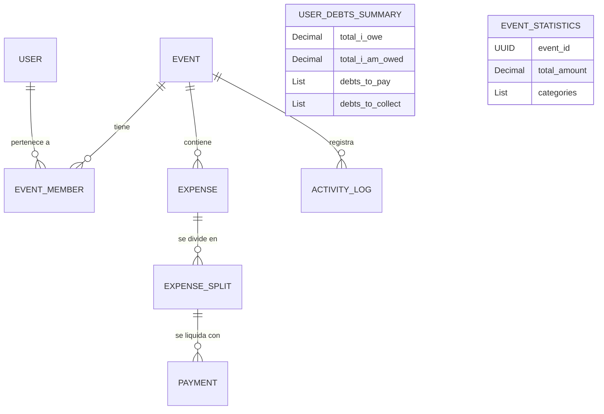

# Data Model: Dashboard Principal, Liquidación de Deudas y Resumen Estadístico

**Feature**: `019-dashboard-debts-insights`
**Date**: 2026-09-01

---

## 1. Esquemas de Datos y Contratos de Entrada/Lectura

Esta funcionalidad se apoya en los modelos de persistencia existentes (`Event`, `EventMember`, `Expense`, `ExpenseSplit`, `Payment`, `ActivityLog`) y añade schemas DTO/Read especializados para agregaciones y vistas optimizadas.

### 1.1 Resumen de Deudas (`DebtsSummaryRead`)

Representa la agregación consolidada o por evento de deudas y acreencias del usuario.

```typescript
interface DebtsSummaryRead {
  total_i_owe: Decimal;          // Suma total adeudada
  total_i_am_owed: Decimal;      // Suma total por cobrar
  debts_to_pay: DebtToPayItem[]; // Desglose de gastos que adeudo
  debts_to_collect: DebtToCollectItem[]; // Desglose de gastos donde me deben
}

interface DebtToPayItem {
  expense_id: UUID;
  split_id: UUID;
  expense_name: string;
  category: ExpenseCategory;
  event_id: UUID;
  event_name: string;
  payer_name: string;
  amount: Decimal;
  payment_status: "no_payment" | "pending_confirmation" | "rejected";
  payment_id?: UUID | null;
}

interface DebtToCollectItem {
  expense_id: UUID;
  expense_name: string;
  category: ExpenseCategory;
  event_id: UUID;
  event_name: string;
  total_pending_amount: Decimal;
  unpaid_count: number;
  pending_verification_count: number;
}
```

### 1.2 Pagos Pendientes de Verificación (`PendingVerificationPaymentRead`)

Representa una notificación en la sección "Requiere atención" para el pagador de un gasto.

```typescript
interface PendingVerificationPaymentRead {
  payment_id: UUID;
  expense_id: UUID;
  expense_name: string;
  event_id: UUID;
  event_name: string;
  debtor_name: string;
  amount: Decimal;
  payment_method: "cash" | "qr";
  created_at: DateTime;
}
```

### 1.3 Evento Reciente con Gasto Personal (`RecentEventRead`)

Representa un evento reciente enriquecido con el gasto personal consumido por el usuario.

```typescript
interface RecentEventRead {
  id: UUID;
  name: string;
  icon: string;
  status: "open" | "closed";
  member_count: number;
  expense_count: number;
  personal_spent_amount: Decimal;
  created_at: DateTime;
}
```

### 1.4 Resumen Estadístico por Categoría (`EventStatisticsRead`)

Representa el desglose financiero del evento agrupado por categoría de gasto.

```typescript
interface EventStatisticsRead {
  event_id: UUID;
  total_amount: Decimal;
  currency: string; // "Bs."
  categories: EventCategoryStatItem[];
}

interface EventCategoryStatItem {
  category: ExpenseCategory;
  label: string;
  amount: Decimal;
  percentage: number; // 0.0 a 100.0
  count: number;
}
```

---

## 2. Diagrama de Relaciones y Flujo de Agregación


